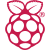

<h1 align="center">
  
</h1>

<h3 align="center">
AI Engineer | Agentic AI & LLM Systems | Full-Stack Developer
</h3>

---

### About Me
- B.Tech Electronics & Computer Engineering (2023–2027) | CGPA: 8.85
- Building agentic AI systems using LangGraph, Groq, and Google Gemini
- Full-stack development with Next.js, Express.js, and MongoDB
- Currently building **TendAI** - an AI-driven blockchain framework for transparent public tendering
- End-to-end AI + Full-Stack integration, from LLM pipelines to production deployment

---

### Tech Stack

#### Languages

#### Frontend & Full-Stack

#### Backend & Databases

#### AI & Data

#### Hardware

#### Tools

